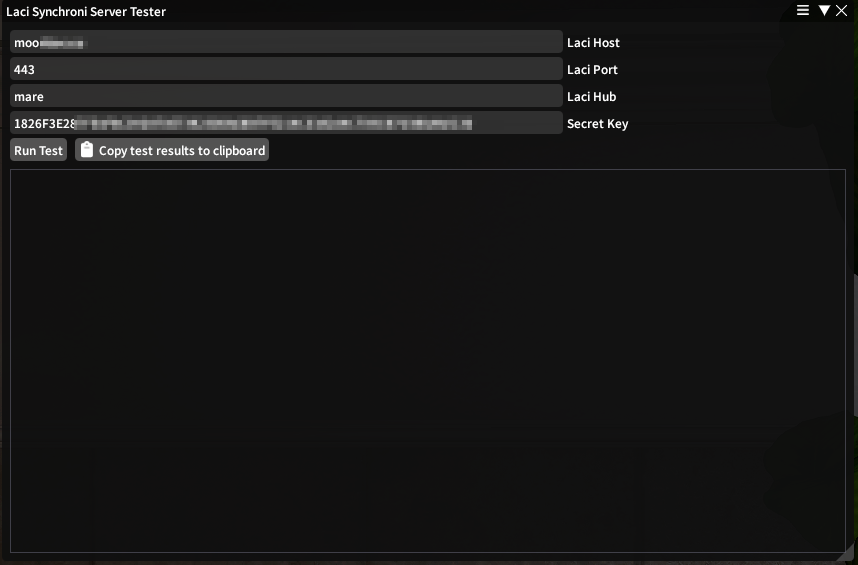
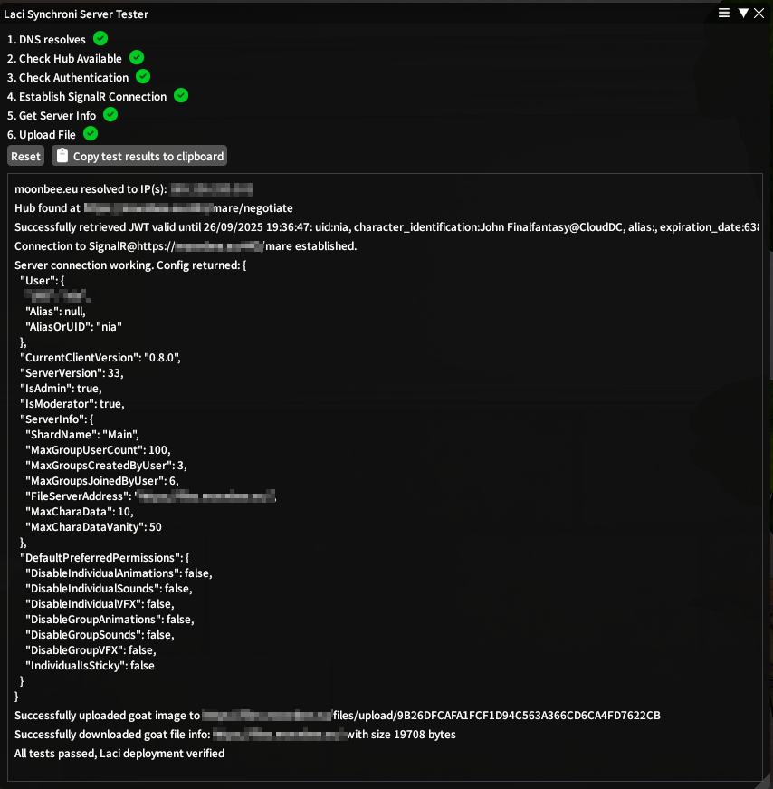

# 5 - Server Tester
:::warning Testing Release Only

Right now, the server tester is only available on the current testing release of the plugin!

:::
:::danger Sensitive Information

The server testers log contains potentially sensitive information like your server's domain name, IP and your own UID! Be 
mindful of that when sharing the log, and consider sharing it only in private.

:::

Laci Synchroni comes with a small server tester tool that can verify basic functionality of your server within the Dalamud
framework. You can run it by using the ``/laci servertest`` command. From there on, simply fill out hostname and your secret
key, and hit run.

If everything goes well, it should look something like this

