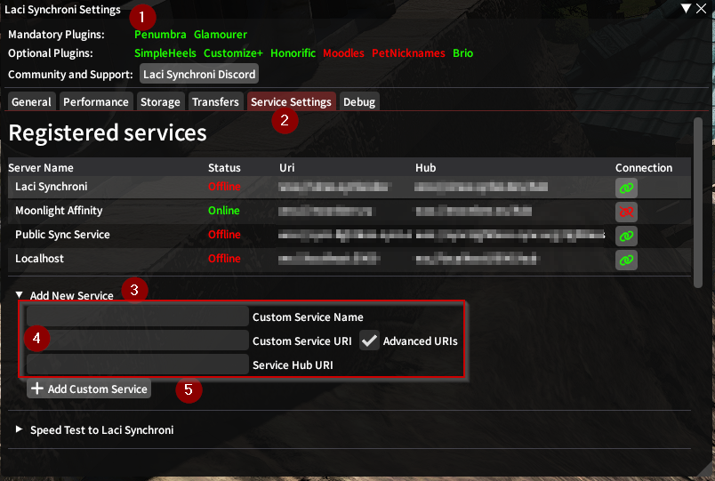

# Adding Extra Services
Laci Synchroni can connect to more than one service at the same time. This guide shows you how to add extra services to your Laci Synchroni plugin.

Before you start, you will need to find the following from your service provider. For large public syncs, please inquire 
in the Laci Synchroni discord. For private syncs, please ask the server owner for the details.

You need:
- **Service URI** - Essentially the web address of the service, for example ``wss://example.com``. It should start with ``wss://``
- **Advanced URI** - Is an advanced URI necessary? This is generally needed for all non-Laci servers. **Please inquire in Laci discord for public sync services!**
- **oAuth yes/no** - Is oAuth enabled for the service? If you are not sure, you can fall back to secret keys

# Configuring the service

1. Open the configuration by using the ``/laci settings command``
2. Navigate to ``Service settings``
3. Open the ``Add New Service`` panel
4. Enter the configuration for the service:
   1. ``Custom Service Name`` can really be anything, it's just the name of the service
   2. ``Custom Service URI`` is the service URI from above
   3. (Optional, as required) ``Advanded URIs`` and ``Service Hub URI`` only needs to be configured if needed, as explained above
5. Hit ``Add Custom Service``

# Authenticating
You now have to choose a method of authentication. Typical Services have oAuth2 enabled, but you can also use Secret Keys
if you only have a Secret Key.

## Authenticating - OAuth2
If your service authenticates with oAuth, you have to authenticate yourself through Discord.

1. Go to settings and to ``Service Settings`` again. 
2. Select the service you just registered
3. Scroll way down until you see ``Service Configuration``. Tick the ``Use Discord oAuth2 Authentication`` checkbox
4. This process takes a few steps, but they are explained in-game. Please start the oAuth process by
clicking the ``Check if Server supports Discord OAuth2`` and follow the steps in-game
5. After authenticating, go to the ``Character Management`` tab
6. Hit ``Update UIDs from Server``
7. Assign your UID to all characters as needed

Now you can hit the green connect button at the top to connect to this service.

## Authentication - Secret Keys
1. Go to settings and to ``Service Settings`` again.
2. Select the service you just registered
3. Scroll way down until you see ``Service Configuration``. Untick the ``Use Discord oAuth2 Authentication`` checkbox
4. Go to ``Secret Key Management`` and add a new key
5. Go to ``Character Management`` and add that key to the current character

